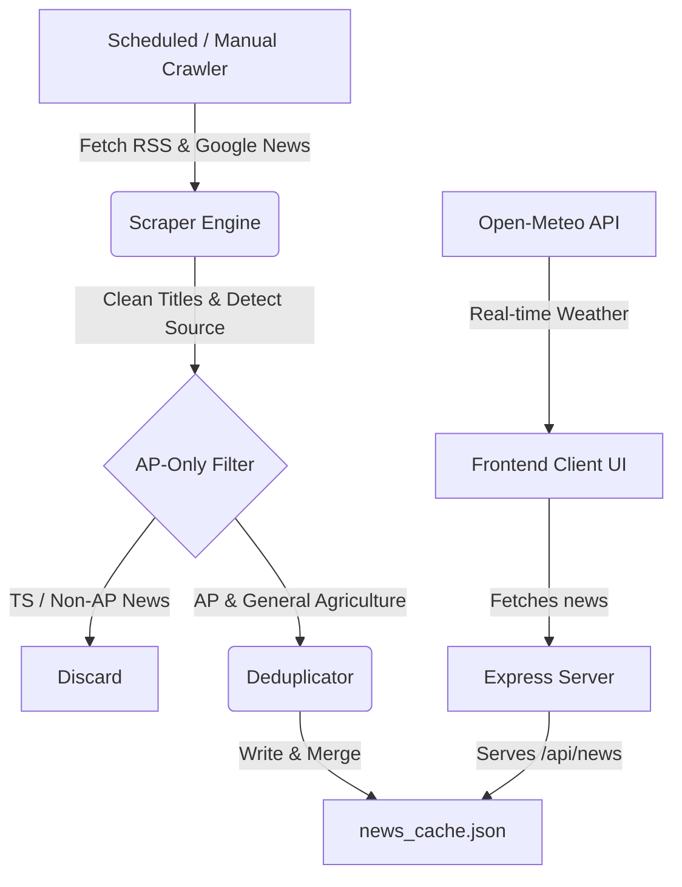

# AP Agriculture News & Intelligence Hub (AP AgriNews Hub)

Welcome to the **AP Agriculture News & Intelligence Hub**—a real-time news crawler and interactive analytical dashboard designed specifically for the **Andhra Pradesh Agriculture Department**. 

This system aggregates, processes, filters, and displays agriculture-related news (crops, fertilizers, schemes, weather, and department notices) across regional and national newspapers, ensuring AP agricultural officers are always updated with strictly relevant state news.

---

## 🛠️ Tech Stack

### Backend Service (Node.js & Express)
*   **Node.js**: The core runtime environment.
*   **Express.js**: Lightweight framework hosting REST API endpoints and serving static frontend assets.
*   **rss-parser**: Parses RSS feeds from news portals and Google News search feeds.
*   **axios**: Performs HTTP requests to fetch external feeds and services.
*   **cors & dotenv**: Handles security cross-origin policies and environment configurations.

### Frontend Dashboard (Vanilla Web Stack)
*   **HTML5**: Structured semantic layout utilizing standard components.
*   **CSS3**: Custom design framework utilizing HSL variables, smooth transitions, responsive grid/flexbox layouts, custom checkboxes, and animations.
*   **Javascript (ES6+)**: Handles DOM manipulation, asynchronous API fetches, multi-dimensional filtering, and reactive views.
*   **Chart.js**: Renders dynamic charts representing news distribution per publisher.
*   **FontAwesome Icons**: High-quality SVG icons for cards and weather stats.

---

## ⚙️ How the Project Works



### 1. Feed Scraping
The scraper periodically queries standardized RSS feeds and Google News search parameters. It queries **11 specific feeds**:
*   *The Hindu* (Agriculture Feed)
*   *The Hindu* (Andhra Pradesh Feed)
*   *Eenadu* (Google News RSS query with Vyavasayam keywords)
*   *Sakshi* (Google News RSS query with Vyavasayam keywords)
*   *Andhra Jyothy* (Google News RSS query)
*   *Andhra Prabha* (Google News RSS query)
*   *Prajasakti* (Google News RSS query)
*   *Suryaa* (Google News RSS query)
*   *Deccan Chronicle* (Google News RSS AP Agriculture query)
*   *Times of India* (Google News RSS AP Agriculture query)
*   *Indian Express* (Google News RSS AP Agriculture query)

### 2. Title & Source Normalization
*   Google News aggregates titles in the format `Headline - Publisher`. The scraper parses this string, extracts the publisher to populate the `source` field, and strips the suffix from the headline (e.g. `సాగులో విత్తనాలు - Eenadu` becomes `సాగులో విత్తనాలు`).
*   Matches and identifies sources individually: *Eenadu, Sakshi, Andhra Jyothy, Andhra Prabha, Prajasakti, Suryaa, The Hindu, Deccan Chronicle, Times of India,* and *Indian Express*.

### 3. Strict AP-Only Filtering
To prevent Telangana-specific local or political news (e.g., statements from Telangana Ministers, Hyderabad local updates) from filling the dashboard, articles pass through a strict filter:
*   **Telangana-Only Indicators**: Checks for keywords like `telangana, revanth, tummala, kcr, ktr, hyderabad` (తెలంగాణ, రేవంత్, తుమ్మల, కేసీఆర్, హరీష్ రావు, కేటీఆర్, హైదరాబాద్).
*   **Andhra Pradesh Indicators**: Checks for keywords like `andhra, ap, amaravati, guntur, vijayawada, visakhapatnam, vizag, nellore, kurnool, chandrababu, lokesh, pawan` (ఆంధ్రప్రదేశ్, అమరావతి, గుంటూరు, విజయవాడ, వైజాగ్, తిరుపతి).
*   **Decision Matrix**: If an article contains Telangana keywords and **does not** contain Andhra Pradesh keywords, it is discarded. General agricultural advice containing neither is kept.

### 4. Deduplication & Caching
*   Normalizes titles (removing spaces, punctuation, symbols) to create a unique alphanumeric key.
*   If an article key or link matches an already cached article, it is skipped.
*   Merges new articles with existing cache, maintaining a maximum size of **500 articles** sorted by publication date (newest first).

---

## 📡 API Endpoints

### 1. `GET /api/news`
Returns the JSON document containing the cached articles and the last sync timestamp.
*   **Request**: `GET http://localhost:3000/api/news`
*   **Response**:
    ```json
    {
      "lastUpdated": "2026-06-24T04:37:45.298Z",
      "articles": [
        {
          "title": "సాగు సన్నద్ధతపై మంత్రి సమీక్ష",
          "link": "https://news.google.com/...",
          "pubDate": "2026-06-24T04:15:00.000Z",
          "snippet": "రాష్ట్రంలో ఖరీఫ్ సాగుకు సంబంధించి విత్తనాలు, ఎరువుల నిల్వలను సిద్ధం చేయాలని...",
          "source": "Eenadu",
          "language": "Telugu",
          "category": "Government Schemes & Dept",
          "scrapedDate": "2026-06-24T04:37:46.846Z"
        }
      ]
    }
    ```

### 2. `POST /api/news/refresh`
Manually forces the scraper engine to run immediately, update `news_cache.json`, and return the updated cache.
*   **Request**: `POST http://localhost:3000/api/news/refresh`

---

## 🔄 Project Workflow (Step-by-Step)

1.  **Initial Startup**: The server starts on port `3000`. If `news_cache.json` is missing or older than 1 hour, it triggers a startup news crawl.
2.  **Background Scheduler**: Runs every hour to pull new articles and append them to the cache.
3.  **UI Rendering**: When a user accesses the dashboard:
    *   Fetches cached articles from `/api/news`.
    *   Displays statistics (Total Articles, Articles Published Today).
    *   Generates a dynamic **Chart.js horizontal bar chart** showing news volume per newspaper.
4.  **Interactive Filtering**: As the user types in the search bar or changes filter checkboxes:
    *   Articles are filtered instantly in the browser.
    *   Chart.js values and statistic counters update reactively to represent the filtered set.
5.  **District Weather & Farming Advisories**:
    *   The weather widget calls the **Open-Meteo API** for coordinates matching the selected AP district.
    *   Translates meteorological metrics (windspeed, temperature, precipitation code) into custom **Agricultural Advisories** (e.g. warnings on pesticide drift, field drainage guidance).
